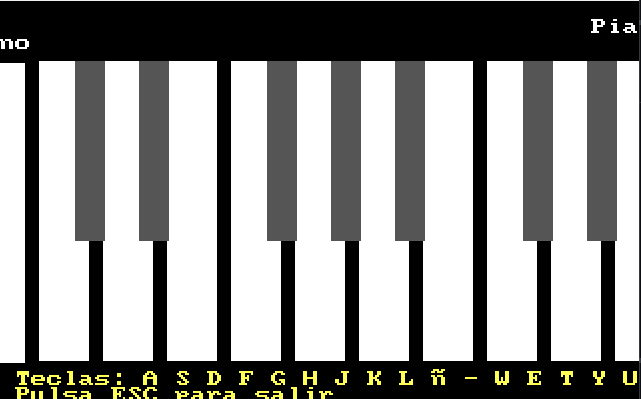

# 🎹 Piano Virtual en Ensamblador x86


Piano virtual interactivo desarrollado completamente en ensamblador x86, con interfaz gráfica VGA y generación de sonido mediante PC Speaker.

---

## 📋 Índice

- [Características](#-características)
- [Requisitos](#-requisitos)
- [Instalación](#-instalación)
- [Uso](#-uso)
- [Arquitectura Técnica](#-arquitectura-técnica)
- [Controles](#-controles)
- [Notas Musicales](#-notas-musicales)
- [Compilación](#-compilación)
- [Estructura del Código](#-estructura-del-código)
- [Contribuir](#-contribuir)

---

## ✨ Características



- **Interfaz Gráfica**: Modo VGA 13h (320x200 píxeles, 256 colores)
- **17 Notas Musicales**: 10 teclas blancas + 7 teclas negras
- **Rango Musical**: C4 (Do) hasta E5 (Mi) - 1.5 octavas
- **Sonido Real**: Generación mediante PC Speaker (Timer 8253)
- **Ultra Compacto**: Menos de 500 bytes de código ejecutable
- **Compatible**: Funciona en DOSBox y hardware x86 real

---

## 💻 Requisitos

- **Ensamblador**: NASM (Netwide Assembler)
- **Emulador**: DOSBox 0.74 o superior
- **Sistema**: Compatible con arquitectura x86

---

## 🚀 Instalación

1. **Clonar o descargar** el repositorio
2. **Compilar** el código fuente (ver sección [Compilación](#-compilación))
3. **Ejecutar** en DOSBox

---

## 🎮 Uso

### Ejecutar en DOSBox

```bash
mount c C:\ruta\al\proyecto
c:
piano3
```

### Salir del Programa

Presiona **ESC** para salir

---

## 🏗️ Arquitectura Técnica

### Componentes Principales

```
┌─────────────────────┐
│  Entrada (Teclado)  │
│     INT 16h         │
└──────────┬──────────┘
           │
┌──────────▼──────────┐
│   Procesamiento     │
│   Comparaciones     │
└──────────┬──────────┘
           │
     ┌─────┴─────┐
     │           │
┌────▼────┐ ┌───▼────┐
│ Sonido  │ │Gráficos│
│ Speaker │ │  VGA   │
└─────────┘ └────────┘
```

### Mapa de Memoria

- **Segmento de Video**: `0A000h - 0AFFFFh` (64 KB)
- **Cálculo de offset**: `Y × 320 + X`
- **Ejemplo**: Píxel en (100, 50) = `50 × 320 + 100 = 16100 bytes`

### Generación de Sonido

El PC Speaker se programa mediante el Timer 8253:

```
Frecuencia = 1193180 / Divisor
```

**Puertos utilizados**:
- `43h`: Registro de control del timer
- `42h`: Contador/divisor de frecuencia
- `61h`: Control del speaker (on/off)

---

## 🎹 Controles

### Teclas Blancas (Notas Naturales)

| Tecla | Nota | Frecuencia |
|-------|------|------------|
| A | Do (C4) | 261.63 Hz |
| S | Re (D4) | 293.66 Hz |
| D | Mi (E4) | 329.63 Hz |
| F | Fa (F4) | 349.23 Hz |
| G | Sol (G4) | 392.00 Hz |
| H | La (A4) | 440.00 Hz |
| J | Si (B4) | 493.88 Hz |
| K | Do (C5) | 523.25 Hz |
| L | Re (D5) | 587.33 Hz |
| Ñ | Mi (E5) | 659.25 Hz |

### Teclas Negras (Sostenidos)

| Tecla | Nota | Frecuencia |
|-------|------|------------|
| W | Do# (C#4) | 277.18 Hz |
| E | Re# (D#4) | 311.13 Hz |
| T | Fa# (F#4) | 369.99 Hz |
| Y | Sol# (G#4) | 415.30 Hz |
| U | La# (A#4) | 466.16 Hz |
| I | Do# (C#5) | 554.37 Hz |
| O | Re# (D#5) | 622.25 Hz |

---

## 🔨 Compilación

### Con NASM

```bash
nasm -f bin piano.asm -o piano3.com
```

### Parámetros

- `-f bin`: Formato binario plano (ejecutable .COM)
- `-o piano3.com`: Nombre del archivo de salida

---

## 📁 Estructura del Código

### Secciones Principales

| Líneas | Sección | Descripción |
|--------|---------|-------------|
| 1-20 | Inicialización | Modo gráfico 13h, segmento de video |
| 21-150 | Renderizado | Dibujo de teclas y texto |
| 151-200 | Bucle Principal | Captura de teclado y procesamiento |
| 201-300 | Funciones Auxiliares | `dibujar_rect`, `tocar_beep`, etc. |

### Funciones Principales

- **`dibujar_rect`**: Dibuja rectángulos en pantalla (teclas)
- **`tocar_beep`**: Genera tonos musicales mediante PC Speaker
- **`escribir_textos`**: Muestra instrucciones en pantalla
- **`escribir_string`**: Función auxiliar de escritura de texto

---

## 🎨 Modo Gráfico VGA 13h

### Especificaciones

- **Resolución**: 320×200 píxeles
- **Colores**: 256 colores (paleta)
- **Memoria**: Linear frame buffer
- **Dirección base**: `0A000h:0000h`

### Paleta de Colores Utilizada

| Color | Valor | Uso |
|-------|-------|-----|
| Negro | 0 | Fondo |
| Gris oscuro | 8 | Teclas negras |
| Amarillo | 14 | Texto de instrucciones |
| Blanco | 15 | Teclas blancas y título |

---

## ⚡ Optimizaciones Implementadas

1. **Uso intensivo de registros** en lugar de memoria RAM
2. **Instrucción `STOSB`** con `REP` para dibujado rápido
3. **Cálculo eficiente de offsets** (multiplicación por 320 optimizada)
4. **Protección de registros** con `PUSH/POP` en funciones críticas

### Consumo de Recursos

- **Memoria RAM**: < 1 KB
- **Tamaño ejecutable**: ~500 bytes
- **CPU**: Compatible con 8086
- **Latencia de sonido**: ~65ms por nota

---

## 🐛 Problemas Resueltos

### 1. Bucle infinito en dibujo
- **Causa**: Registro CX corrupto por `MUL`
- **Solución**: Protección con `PUSH/POP`

### 2. Colores incorrectos
- **Causa**: Registro AL modificado
- **Solución**: Guardar color en DH

### 3. Teclas sin separación
- **Causa**: Ancho de 30px sin espacio
- **Solución**: Teclas de 25px con espaciado de 32px

### 4. Texto invisible
- **Causa**: Uso incorrecto de INT 10h
- **Solución**: Implementar teletype (AH=0Eh)

---

## 🚀 Mejoras Futuras

### Funcionalidades
- [ ] Grabación y reproducción de secuencias
- [ ] Diferentes instrumentos (formas de onda)
- [ ] Control de volumen
- [ ] Indicador visual de tecla presionada
- [ ] Más octavas (extender rango)
- [ ] Pedal de sostenido (tecla SHIFT)

### Optimizaciones Técnicas
- [ ] Modo protegido VESA
- [ ] Tabla de sprites para caracteres
- [ ] Double buffering (evitar parpadeo)
- [ ] Soporte Sound Blaster

---

## 📚 Interrupciones BIOS Utilizadas

| INT | AH | Función | Uso |
|-----|----|---------|----|
| 10h | 00h | Establecer modo video | Modo gráfico 13h |
| 10h | 02h | Posicionar cursor | Ubicar texto |
| 10h | 0Eh | Teletype output | Escribir caracteres |
| 16h | 00h | Leer tecla | Entrada usuario |
| 21h | 4Ch | Terminar programa | Salir |

---

## 🔧 Puertos I/O Utilizados

| Puerto | Descripción | Operación |
|--------|-------------|-----------|
| 42h | Timer Counter 2 | OUT (divisor) |
| 43h | Timer Control Register | OUT (comando) |
| 61h | PC Speaker Control | IN/OUT (on/off) |

---

## 🎓 Aprendizajes

Este proyecto permite comprender:

- **Programación de bajo nivel**: Manejo directo de hardware (VGA, Timer, Speaker)
- **Arquitectura x86**: Interrupciones BIOS, puertos I/O, segmentación
- **Optimización extrema**: Código funcional en menos de 500 bytes
- **Resolución de problemas**: Debugging sin herramientas modernas

---

## 📝 Licencia

Este proyecto es de uso educativo.

---

## 👤 Autor

Proyecto desarrollado como ejercicio de programación en ensamblador x86.

---

## 🙏 Agradecimientos

- Comunidad de programadores en ensamblador
- Documentación de NASM
- Proyecto DOSBox

---

**¡Disfruta tocando el piano virtual! 🎵**